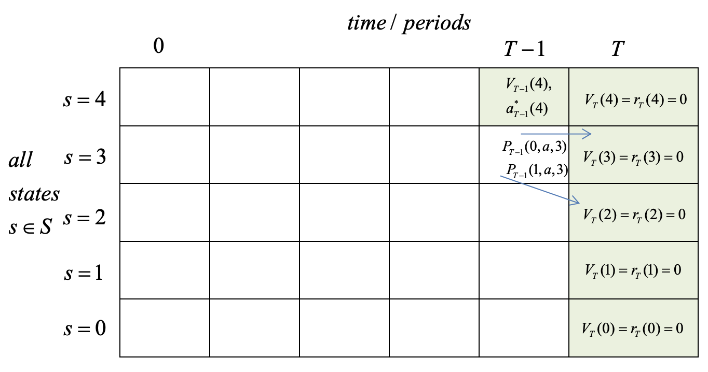

# Übung 6: Dynamic Programming

Pro Übung gibt es 20 Punkte. Für eine Zulassung zur Klausur ist der Erwerb von mindestens 50% aller Punkte über alle Übungsaufgaben erforderlich, wobei Leerabgaben von Übungen nicht erlaubt sind.

## Aufgabe 1 - Airline Tickets (6 Punkte)

Relevante Dateien: environments.h

Ziel dieser Aufgabe ist es, einen iterativen Algorithmus zu implementieren, der auf der Idee von Dynamic Programming beruht, wenn auch in leicht abgeschwächter Form.

Unser Beispielanwendungsfall betrachtet den möglichst effizienten Verkauf von Tickets für den in der letzten Aufgabe bereits bekannten Flug von BER nach JFK. Da wir das Problem aus Sicht der Airline betrachten, wollen wir den zu erwartenden Gewinn maximieren. Dafür muss zuallererst eine Simulation des Verkaufsprozesses entwickelt werden.

Unser Verkaufsprozess ist in Zeitschritte von 0 bis inklusive maxTime eingeteilt. Abgesehen von der bisher vergangen Zeit, kann unser Verkaufsprozess in jedem Zeitschritt unterschiedliche Zustände haben. Dies ist charakterisiert durch eine einzelne int-Zahl, bezeichnet als state. Diese enthält die Anzahl noch zur Verfügung stehender Tickets. In jedem Schritt kann, abhängig vom aktuellen Preis, entweder das Ereignis "ein Verkauf" oder "kein Verkauf" eintreten. Diese beiden werden im Code als "event" bezeichnet, und nehmen entweder den Wert 1 oder 0 an. Die Preisentscheidung die wir treffen müssen bezeichnen wir im Folgenden als action. Es gibt eine Preisspanne, die durch eine untere, eine obere Schranke und eine Schrittweite definiert ist. Bei minAction=5, maxAction=15 und actionStep=5 sind 5, 10, 15 erlaubte Preise. In jedem Schritt erhält der Algorithmus einen Reward, der seinen Erfolg in Zahlen fasst. Im Falle eines Verkaufs entspricht der Reward dem gewählten Preis. Ohne Verkauf ist der Reward 0. Nach Ablauf von maxTime Schritten, fällt für den letzten Schritt eine Gebühr an, sollten noch Tickets übrig sein. Diese ist als negative Zahl in finalReward gespeichert. Der Prozess ist dann beendet.

Der Ablauf des Verkaufsprozess ist wie folgt: Wir beginnen mit time=0, state=initialState. Der Agent wählt nun einen Preis, und anhand der im nächsten Absatz beschriebenen Funktion berechnen wir die Wahrscheinlichkeit dass er ein Ticket verkauft. Verkauft er ein Ticket, reduziert sich state um 1. In jedem Fall erhöht sich im nächsten Schritt time um 1. Beim erreichen von time=T wird ein letzter Verkaufsschritt durchgeführt, danach ergibt sich eine Strafe von state\*finalReward.

Das Ziel besteht jetzt darin, herauszufinden welchen Preis wir in jedem Zeitschritt und jedem Zustand aufrufen müssen, damit die Summe der Rewards inklusive der abschließenden Strafe, so groß wird wie möglich.

Um diese Lösung berechnen zu können, müssen wir zuallererst ein paar Funktionen implementieren die uns helfen, diese Umgebung zu simulieren.
Zu diesen Funktionen gehören:

- `getReward()` (Berechnet für einen gegebenen Zustand und ein gegebenes Ereignis (1 = Verkauf), welchen Reward der Agent enthält. Der Reward ist 0, wenn kein Ticket zur Verfügung steht, selbst wenn ein Verkauf auftreten würde.)
- `getNextState()` (Berechnet auf Basis des eingetretenen Ereignisses und des letzten Zustands, den Zustand im nächsten Schritt. Der Zustand kann auch bei Verkauf nicht kleiner als 0 werden.)
- `getFinalReward()` (Berechnet für einen bestimmten Zustand, wie groß die Strafe am Ende des Prozesses ausfällt.)
- `getEventProbability()` (Berechnet für einen gegebenen Zustand, Action, Zeit und Ereignis, wie wahrscheinlich es ist dass dieses Eintritt. Wir legen für die Simulation fest, dass die Wahrscheinlichkeit eines Verkaufs (1 - action / maxAction) \* (1 + time) / maxTime) ist. Die Wahrscheinlichkeit des 0-Ereignisses, beträgt 1 - die Wahrscheinlichkeit eines Verkaufs.)

Beachten Sie, dass aufgrund der automatischen Konvertierung von CPP es sinnvoll sein kann, manche der Eingabewerte vor den Berechnungen in double zu konvertieren.

Implementieren Sie diese 4 Funktionen in der Klasse `TicketEnvironment`, die von `BasicEnvironment` erbt.

## Aufgabe 2 - Lösungsalgorithmus (10 Punkte)

Relevante Dateien: solver.h, solver.cpp, actionchoice.h

Mit den 4 Funktionen aus der ersten Aufgabe und den bereits implementierten get-Funktion des BasicEnvironments kann nun der Solver implementiert werden.

Das Ziel besteht darin, herauszufinden wie wir in jedem Schritt den Preis setzen müssen, damit wir über den gesamten Prozess die Summe aller Rewards maximieren.

Die Idee des als Backward Induction bezeichneten Lösungsalgorithmus, besteht darin den Verkaufsprozess RÜCKWÄRTS zu durchlaufen.

### computeFinalRewards() - Berechnen des abschließenden Rewards

Wir beginnen also, indem wir in `computeFinalRewards()` für JEDEN möglichen Zustand (0 ... getMaxState) bestimmen, wie groß der abschließende Reward wäre. Dazu kann die getFinalReward-Funktion des Environments genutzt werden.

### computeExpectedRewardForAction() - Berechnen des zu erwartenden Rewards für eine einzelne Kombination von Zustand, Zeit und Aktion

Danach, laufen wir von diesem Schritt aus einen Zeitschritt rückwärts (t=getMaxTime) und betrachten wieder JEDEN Zustand. Ausgehend von jedem Zustand, wird jetzt jede erlaubte Aktion (Siehe Aufgabe 1) betrachtet wird. Für jede mögliche Aktion, bestimmen wir den erwarteten Reward ab diesem Schritt. Diesen bestimmen wir, indem wir für jedes Ereignis 3 Zahlen bestimmen:

- Den zu erwarteten Reward ab dem Folgezustand (den wir vorher berechnet haben, da wir RÜCKWÄRTS in der Zeit rechnen, wir müssen nur herausfinden welchen Zustand wir bei diesem Ereignis und diesem Ausgangszustand erreichen)
- Den zu erwarteten Reward in diesem Schritt (Liefert uns das Environment)
- Die Wahrscheinlichkeit, dass dieses Ereignis eintritt.

Sind alle 3 Zahlen für jedes Ereignis bekannt, ist der zu erwartende Reward für diese Zustand und diese Aktion in diesem Zeitschritt dadurch definiert, dass wir für jedes Ereignis berechnen:
(Wahrscheinlichkeit dass dieses Ereignis eintritt \* (Reward in diesem Schritt + Reward ab dem Folgezustand))

Summieren wir diese Zahl über alle Ereignisse für einen Zustand bei gegebener Aktion, erhalten wir den Erwartungswert für den Reward ab diesem Schritt, wenn wir die ausgewählte Aktion ausführen. Diese Zahl soll in der Funktion `computeExpectedRewardForAction()` berechnet werden.

### computeExpectedRewardForTimeAndState() - Berechnen des zu erwartenden Rewards für eine einzelne Kombination von Zustand und Zeit

Wir suchen nun für jeden Zustand, nach der Aktion die diesen Wert maximiert. Die Suche nach der Aktion bei gegebenem Zustand und Zeit soll in `computeExpectedRewardForTimeAndState()` implementiert werden. Dies erfolgt, indem wir iterativ alle erlaubten Werte für action ausprobieren und das Maximum über alle Actions bestimmen.
Daraus erzeugen wir eine `ActionChoice` (die Datenstruktur ist bereits gegeben), in der die ausgewählte Aktion und der erwartete Reward ausgehend von diesem Schritt abgespeichert werden.

### computePolicy() - Berechnen der optimalen Aktion für jeden Zeitschritt und Zustand

In zwei Arrays merken wir uns nun für jeden Zustand in diesem Schritt, welche Aktion den erwarteten Gewinn maximiert und wie hoch der Erwartungswert dieser Aktion war. Diese entnehmen wir der zurückgegebenen `ActionChoice`.

Dann reduzieren wir den betrachteten Zeitschritt um 1, und nutzen das vorher berechnete Array als Grundlage, um die zu erwartenden Rewards für den vorherigen Schritt zu bestimmen. Zuallerletzt erreichen wir Schritt 0 und schließen die Berechnung ab. Das Aggregieren der Werte für jeden Zustand und die Iteration rückwärts durch die Zeit soll in computePolicy implementiert werden.

Als Speicher für die Aktionsauswahl, kann ein einzelenes int-Array genutzt werden, welches intern für jeden Zeitschritt und für jeden Zustand die Aktionsauswahl speichert. Will man die Aktion für Zustand 10 in Zeitschritt 5 auswählen, multipliziert man dann den Zeitschritt mit der Anzahl möglicher Zustände + 1, z.B. bei Maxstate 20 ergibt sich daraus [5 * (20 + 1) + 10]. Beim Anlegen von Arrays, welche erwartete Rewards für einen Zeitschritt speichern, muss beachtet werden, dass die Zahl möglicher Zustände = maxState + 1 ist (0 ist ebenfalls erlaubt). Dasselbe gilt für Arrays über alle Zeitschritte, da der Prozess den letzten Verkauf in maxTime durchführt und nicht in maxTime - 1. Ein Beispiel für die Adressierung zweier Dimensionen in einem eindimensionalen Array findet man in den Tests ;).

Eine Visualierung eines Schrittes dieser Berechnung:

Müssen wir nun tatsächlich den Verkaufsprozess ausführen, können wir einfach für jeden Zustand nachsehen, welche Aktion als optimal vermerkt wurde und diese wählen.

## Aufgabe 3 - Komplexität (4 Punkte)

Relevante Dateien: solution.md

Geben sie an, welche Komplexität der beschriebene Algorithmus in Abhängigkeit zur der Anzahl Aktionen A, des maximalen Zustand S, der Anzahl Zeitschritte T und der Zahl möglicher Ereignisse E hat.
